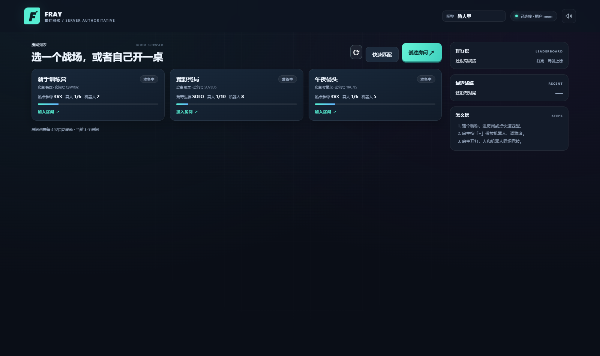
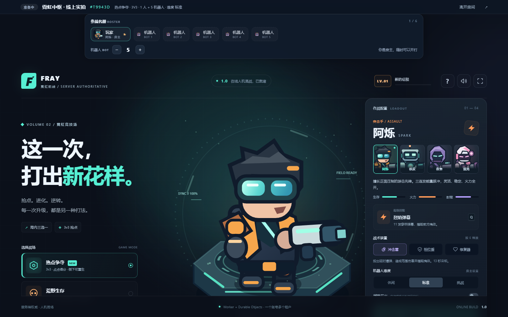
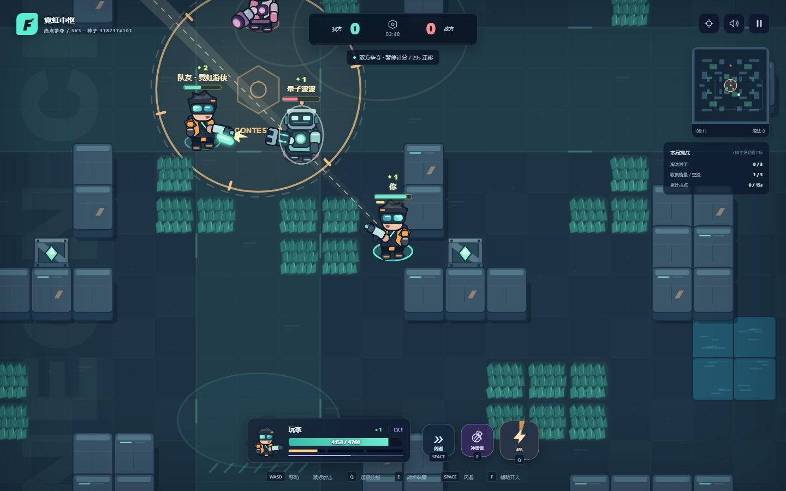

# FRAY · 霓虹前线

**服务器权威的在线多人竞技射击，跑在 Cloudflare Workers + Durable Objects 上。**

打开一个网址，看到一屋子房间；开一桌、或者加入别人的桌子；房主往场里投放机器人；
开打之后，真人和机器人在同一张地图上互相淘汰。

### 线上就绪（已部署，可直接点开玩）

| 入口 | 地址 | 托管 |
|---|---|---|
| **前端（发给别人就发这个）** | <https://fray.lemonhall.me> | Vercel |
| 前后端同一个域名 | <https://fray-api.lemonhall.me> | Cloudflare Workers |
| 后端 API | <https://fray-api.lemonhall.me/v1/health> | Workers + Durable Objects + D1 |

打开就是房间浏览器：右上角输个昵称进站 → 建房或从列表里加入别人的房间 →
房主投放机器人（免费计划即可）→ 开打。两个入口跑的是**同一份前端产物**，
区别只是前端连的后端地址一个是绝对地址、一个是同源。

> 后端为什么不直接用 `*.workers.dev`：那个域名在国内是**解析层就被污染**的，查得到、
> 连不上。绑到自己 zone 下的子域（`wrangler.jsonc` 里的 `routes` + `custom_domain: true`）
> 之后走的是同一套 anycast，国内直连可用。实测：不走代理
> `curl https://fray-api.lemonhall.me/v1/health` 返回 200。



> 下面这些图是**线上生产环境**的实拍（Playwright 真的打开 Vercel 上那个站点，
> 走一遍开房 → 加入 → 放机器人 → 开打），来源与拍法见
> [`docs/shots/README.md`](docs/shots/README.md)。

| 候场：名册 + 房主控制 | 竞技场：人机混战 |
|---|---|
|  |  |

---

## 这是什么

一个**移植型项目**：把一份纯前端的单机俯视角吃鸡玩法，改造成"服务端权威 + 多租户 +
人机混战"的在线版本。原版的那套美术（手绘矢量精灵、霓虹竞技场的皮）被逐字节保留，
玩法逻辑则被重写成一份**前后端共用的确定性内核**。

它同时是一个**架构演示**：一个 Cloudflare 账号怎么同时运营多个在线游戏。

### 它不是什么

* 不是某个开源项目的分支，也没有沿用任何现有项目的名字或代码；
* 不是"客户端算一切、服务器只管转发"的伪联机；
* 不需要付费计划：游戏逻辑编译进 Worker，**没有用 Worker Loader / Dynamic Workers**
  这类需要升级计划的能力，免费计划即可部署；
* 还**没有**账号体系（只有游客令牌）、没有语音/聊天、没有排位。

---

## 三十秒理解架构

```
共享内核 sim/  ── 同一份纯 JS 模块 ──┬──► Durable Object 里：权威模拟（60Hz 定步）
                                    └──► 浏览器里：只预测"我自己"的位移

Worker（无状态）      只管认租户 / 认令牌 / 路由 / CORS
Room DO（一个房间）   名册、开局、推进、可见性过滤、结算  ← 唯一的权威
Lobby DO（一个租户）  房间目录（单点强一致）
D1                    租户表 + 战绩表
```

* **前端只上报意图**（往哪走、朝哪打、开不开火），坐标从不上行；
* **后端算一切**（命中、死亡、得分、谁赢），并按每个人的视角裁剪快照；
* **草丛里看不见的敌人，根本不进你的报文**——可见性即反作弊；
* Room DO 里**没有常驻定时器**：模拟被"客户端消息"驱动，5 秒 alarm 只做兜底。

完整讲解（前端干啥 / 后端干啥 / 一局发了哪些请求，逐条）：

* [`docs/architecture.md`](docs/architecture.md) —— 架构与时序
* [`docs/protocol.md`](docs/protocol.md) —— 线协议与消息频率

---

## 本地跑起来

前提：Node ≥ 20、本机已登录 `wrangler`（`npx wrangler whoami` 能返回账号即可）。

```powershell
cd E:\development\fray
npm install
node tools/build.mjs            # 把 sim/ 复制进 web/sim/，并注入后端地址
npx wrangler dev --port 8790 --local
```

浏览器打开 `http://127.0.0.1:8790/` —— 第一次需要注册一个租户（本地 D1 里）：

```powershell
$env:ADMIN_KEY='dev-admin-key-local-only-4c72'   # 与 .dev.vars 一致
curl.exe -X POST http://127.0.0.1:8790/v1/tenants -H "authorization: Bearer $env:ADMIN_KEY" `
  -H "content-type: application/json" -d '{"id":"neon","displayName":"霓虹前线"}'
```

想要"两个人打一局"，开两个浏览器窗口（一个用隐身模式）各自输昵称即可：
第一个开房、往里放机器人、开打；第二个从房间列表点进来。

---

## 测试

```powershell
npm test                        # 50 个单元测试：内核、名册、权限、线格式、路由、DOM 契约、身份、手感
npm run e2e                     # 双客户端联调（需要本机 Chrome + Playwright）
npm run smoke                   # 纯服务端冒烟：HTTP + WebSocket 走完一局，不需要浏览器
```

`npm test` 里有几类值得单独说的断言：

* **可见性**：躲在草丛里的敌人不出现在快照里，点亮之后才出现；死掉的敌人不进快照，
  但"死掉的我自己"还在（要能看见复活倒计时）。
* **确定性**：同一个种子生成同一张地图，解码后墙与草丛逐格一致。
* **DOM 契约**：`web/js/*.mjs` 里引用的每一个 `id` 都必须在 `index.html` 里存在——
  这条能挡住"改了 id 导致某个按钮静默失灵"这类最容易漏的问题。
* **名册/权限**：非房主改机器人数量、改模式、开局，都必须被服务端拒绝。
* **身份闸门**：改名要重签令牌，但"先发出、后到达"的旧令牌不能覆盖新的——
  否则会出现"用令牌 A 建房、用令牌 B 连 socket"，表现就是**房主忽然没有房主权限**。
  这条只有在跨境延迟（几百毫秒 + 抖动）下才会现形，本地跑一百遍都不一定复现，
  所以必须写成测试钉住。
* **手感（延迟链路对拍）**：`tests/netcode-replay.test.mjs` 把"会抖、会堵"的链路
  做成可编程的模型，让真实的客户端模块隔着它跟权威端跑几秒，然后量两件事——
  本机画面有没有往后退、有没有偏离"从出生点重放全部命令"那条理想轨迹。同一段
  输入还会跑一个**对照组**，把对账规则换回旧版；对照组每次都被拽回几十上百像素，
  证明这条测试真的看得见那个 bug，而不是恰好断言在一个死数字上。

`npm run e2e` 更有意思：它真的开两个 Chrome，一个开房一个加入，走完
**开房 → 列表里看到 → 点进去 → 房主加机器人 → 开打 → 两边进场 → 移动 → 对射**，
并且断言"开打后 2.5 秒内必须有第一帧快照"这种时序上的硬要求。

> E2E 只用本机 Chrome（`channel:"chrome"`），不会去下载 Playwright 自带的浏览器。
> Playwright 需要装在仓库里（`npm i -D playwright`），或者全局装好后给它指路：
> `$env:E2E_PLAYWRIGHT_DIR='E:\dev-state\npm-global\node_modules'; npm run e2e`

`npm run smoke` 是部署后最省事的那道自检——16 条断言，几秒钟出结果。它打的是
**线上**还是本地，全看环境变量：

```powershell
$env:SMOKE_BASE='https://fray-api.lemonhall.me'
$env:HTTPS_PROXY='http://127.0.0.1:7897'; $env:NODE_USE_ENV_PROXY='1'   # 国内直连打不通时
node tools\smoke.mjs
```

它是纯 Node（只用内置 `fetch` / `WebSocket`），所以 CI 里不需要 Chrome。

---

## 部署

后端（Cloudflare Workers + Durable Objects + D1）：

```powershell
$env:HTTPS_PROXY='http://127.0.0.1:7897'       # 走本机代理
npx wrangler d1 create fray                     # 首次：把返回的 database_id 填进 wrangler.jsonc
npx wrangler deploy
npx wrangler secret put SESSION_SECRET          # 生产密钥：签玩家令牌
npx wrangler secret put ADMIN_KEY               # 生产密钥：注册租户用
```

前端（同一份 `web/` 产物，可以放到任何静态托管上）：

```powershell
vercel link --yes --project fray                # 首次：把仓库绑到一个 Vercel 项目
vercel --prod                                   # 之后每次部署都是一条命令
```

这里不需要手工设 `FRAY_API`：它写在 [`vercel.json`](vercel.json) 的 `build.env` 里，
Vercel 云端跑 `npm run build` 时会自动注入，**GitHub 推一下就会重建生产环境**——
所以这个仓库的推送即部署，前端不会和后端漂移。

想手工出产物（比如发到别的静态托管）就照旧：

```powershell
$env:FRAY_API='https://fray-api.<你的子域>.workers.dev'; node tools/build.mjs
```

`web/` 既是 Worker 的静态资源目录（同源部署时前端后端一个域名），也是 Vercel 的
输出目录（跨域部署时前端走 `?api=` / 构建期注入）。**同一份产物，两种部署方式**，
这就是"前端可以被换掉"的具体含义。

上线之后注册线上租户（不带 `--local` 的那些 wrangler 命令操作的就是真实资源）：

```powershell
curl.exe -X POST https://fray-api.lemonhall.me/v1/tenants `
  -H "authorization: Bearer $env:ADMIN_KEY" -H "content-type: application/json" `
  -d '{"id":"neon","displayName":"霓虹前线"}'
```

---

## 目录

```
sim/        共享内核（服务端与浏览器同一份）：地图 / 角色 / 战斗 / 子弹 / AI / 世界推进 / 线格式
src/        Worker 与 Durable Object：路由 / 认证 / 租户 / Lobby / Room / 结算
web/        静态站点：index.html + 原版皮肤 game.css + 联机层 net.css + js/ 各模块
tools/      build（复制内核+注入地址）/ extract-original（一次性抽取原版皮肤）/ rebrand
            smoke（纯服务端冒烟，无浏览器）/ e2e-local（双 Chrome 联调）
            latency-proxy（TCP 延迟注入）/ netcode-probe（手感探针，挂延迟代理跑）
tests/      node:test —— 内核、名册、权限、线格式、路由、DOM 契约、身份、手感
docs/       architecture.md（架构与时序）、protocol.md（线协议）、shots/（截图）
```

---

## 现状

**已上线**：后端 `fray-api.lemonhall.me`（免费计划，无 Worker Loader），
前端 `fray.lemonhall.me`；线上冒烟 16/16、线上双客户端 E2E 10/10 通过。

已经能玩：

* 房间浏览器（列房间 / 建房 / 快速匹配 / 排行榜 / 最近战绩），多租户；
* 候场名册、房主投放机器人、调难度、换模式、开局；
* 两种模式：**热点争夺 3v3**（占点、可重生）与**荒野生存 10 人混战**（缩圈、最后存活）；
* 人机混战：AI 会占点、找掩体、找补给、预判射击、感知式躲弹；
* 局内三选一强化（最多 6 级）、战术装置（手雷 / 相位盾 / 修复器）、大招、闪避；
* 服务端结算、战绩落库、排行榜；
* 中途加入（掉线的人角色留在场上，重连接着用同一个实体）。
* **跨境链路上移动不"被拽回"**：本地预测 + 命令时间线对账，100ms 单向延迟 +
  30ms 抖动 + 1.2 秒拥塞窗口实测，最大单帧回退从 288px 降到 0.1px（详见
  `docs/architecture.md` 的"为什么移动不会被拽回去"）。

已知取舍 / 下一步：

* 游客令牌无状态，**不能主动吊销**；要接真实账号得用 `POST /v1/{tenant}/sessions`；
* 没有观战席：中途进来就是直接进场补位（对小体量 demo 更划算）；
* 单区域 D1；要做全球低延迟得把战绩读写拆到 D1/外部存储的合适区域；
* 线格式是 JSON，带宽不是当前的优化目标（可读性优先）；
* Room 里的世界只在内存 + 房间存储里，没有做跨房间的观战/回放。

---

## 命名与授权

项目名、文案、代码全部为本项目自有。原版那份单机 HTML 只作为**美术与玩法参考**：
它的 CSS 与矢量精灵被逐字节抽取保留（见 `tools/extract-original.mjs`），
游戏逻辑是在共享内核里重写的。两者没有代码继承关系，也没有沿用彼此的名字。

MIT License。
